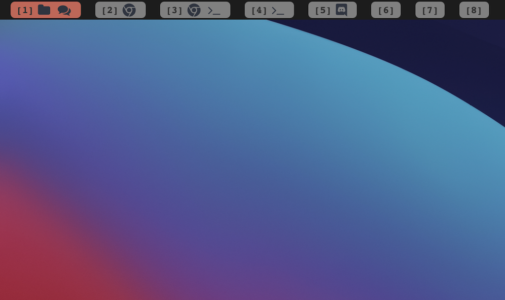

# zbar

Performance oriented [Übersicht](https://github.com/felixhageloh/uebersicht) widget status bar for [yabai](https://github.com/koekeishiya/yabai). The widget bar is intended to be used along with the native macOS system tray bar (toggle hiding).

I forked from [nibar](https://github.com/kkga/nibar) and trimmed down features to make the bar as performance-friendly as possible.



## Installation

Clone this repo to your Übersicht widgets directory.

```bash
# assuming your widgets are in the default Übersicht location
$ git clone https://github.com/zzandland/zbar $HOME/Library/Application\ Support/Übersicht/widgets/zbar
```

## Usage

### Refreshing yabai workspaces widget

The workspaces widget is not refreshing automatically (to preserve battery). Add these lines at the end of your `yabairc` to utilize [yabai's signals](https://github.com/koekeishiya/yabai/wiki/Commands#automation-with-rules-and-signals) for auto-updating the widget whenever a workspace is changed:

```sh
yabai -m signal --add event=space_changed \
    action="osascript -e 'tell application \"Übersicht\" to refresh widget id \"zbar-spaces-jsx\"'"
yabai -m signal --add event=application_launched \
    action="osascript -e 'tell application \"Übersicht\" to refresh widget id \"zbar-spaces-jsx\"'"
yabai -m signal --add event=application_terminated \
    action="osascript -e 'tell application \"Übersicht\" to refresh widget id \"zbar-spaces-jsx\"'"
yabai -m signal --add event=window_created \
    action="osascript -e 'tell application \"Übersicht\" to refresh widget id \"zbar-spaces-jsx\"'"
yabai -m signal --add event=window_destroyed \
    action="osascript -e 'tell application \"Übersicht\" to refresh widget id \"zbar-spaces-jsx\"'"

# if using multple displays, add an additional rule for "display_changed" event
yabai -m signal --add event=display_changed \
    action="osascript -e 'tell application \"Übersicht\" to refresh widget id \"zbar-spaces-jsx\"'"
```
